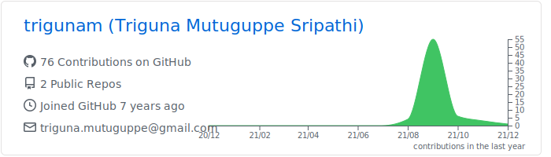
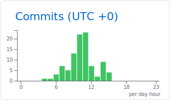

I am [Triguna Mutuguppe Sripathi](https://www.linkedin.com/in/triguna/). I work as a Full Stack Architect at Philips HealthSuite Platform.

- 🔭 I’m currently working on HSP Self Service UI for IAM, S3, Audit, Notification, BDP and promoting open and inner source within Philips.
- 🌱 I’m currently learning Github Actions.
- 💬 Ask me about [Playstation](https://www.youtube.com/channel/UCv4Uy64oNR4vzMREojY9Mgw?sub_confirmation=1), solving any problem and best way to troubleshoot
- 📫 How to reach me: That should not be too hard
- ⚡ Fun fact: I love solving puzzles in free time and [game for a chess](https://www.chess.com/member/gametriguna)

### Analytics ⚙️

  
  

### Let's connect? 🤝

   

### Trophies

<table><tbody><tr><td /><td /><td /><td /><td> </a></td><td /><td /><td /><td /></tr></tbody></table>
