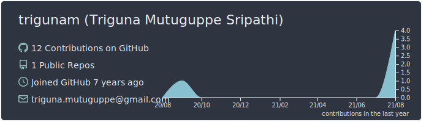
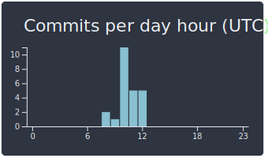

I am [Triguna Mutuguppe Sripathi](https://www.linkedin.com/in/triguna/) and work as a Full Stack Architect at Philips HealthSuite Platform and reusable components in github with Java, JavaScript, Python, User Interface (React.js, Next.js, Angular).

- 🖥️ I’m currently working on HSP Self Service UI for IAM, S3, Audit, Notification, BDP and promoting open and inner source within Philips.
- 🌱 I’m currently learning Github Actions.
- 💬 Ask me about [Playstation](https://www.youtube.com/channel/UCv4Uy64oNR4vzMREojY9Mgw?sub_confirmation=1), solving any problem and best way to troubleshoot
- 📫 How to reach me: That should not be too hard
- ⚡ Fun fact: I love solving puzzles in free time and [game for a chess](https://www.chess.com/member/gametriguna)

### Technologies 🧑‍💻

    

### Repositories 📒

#### [toString - implementation - Java Utility](https://github.com/trigunam/tostring-implementation)

#### [Reusable REST Header - JavaScript Utility for REST APIs](https://github.com/trigunam/reusable-rest-header)

### Analytics ⚙️

  
  

### Let's connect? 🤝

   

### Trophies

